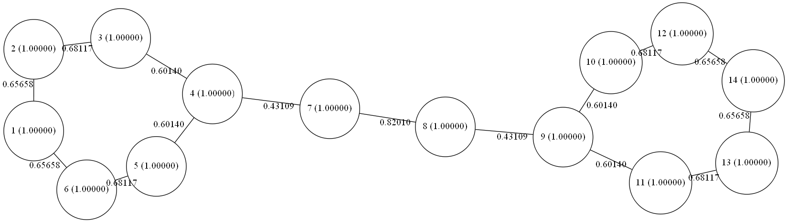

# Huckel-Molecular-Orbital-Calculation (HMO)

A program to perform Huckel molecular orbital caluclations on molecules.

`HMO` is a light-weighted program to perform Huckel molecular orbital caluclations on molecules. It is very easy to use and can generate `Graphviz` input files for the visualization of results.

## Compiling HMO

To compile `HMO`, you need `boost` and `Lapack`. You can set the path of the `Lapack` library in `Makefile` and then simply type
```
make
```
Everything should go well.

## Excutables

If you do not want to compile `HMO`, you can go to my website to get the excutables.

[HMO on my website](http://www.zhjun-sci.com/software-others.php)


## Example

An example input file is given in  `bin/styrene.inp`:
```
1.8 0
 C                 -3.33505854   -4.05509747    0.03172776
 C                 -1.93989854   -4.05509747    0.03172776
 C                 -1.24236054   -2.84734647    0.03172776
 C                 -1.94001454   -1.63883747    0.03052876
 C                 -3.33483954   -1.63891547    0.03004976
 C                 -4.03244054   -2.84712147    0.03104576
 C                 -1.16951047   -0.30544951    0.03044614
 C                 -1.84201131    0.87111682    0.02928423
 C                 -1.06360352    2.19990338    0.03203690
 C                 -1.75320092    3.41233984    0.03084857
 C                  0.33149892    2.19089168    0.03626174
 C                 -1.04780409    4.61603387    0.03357108
 C                  1.03679478    3.39425768    0.03850471
 C                  0.34687625    4.60719876    0.03679910
```

In the first line,

* `1.8` is a threshold, meaning that two atoms are considered as bonded when their distance is less than `1.8` Angstrom.
* `0` is the charge of the moledcule, which can be `0`, `+1`, `-2`, etc.

The following lines are the coordinates of carbon atoms. Do **NOT** write coordinates of other atoms.

With this file, run the calculation:
```
hmo styrene.inp > styrene.out
```

In `styrene.out`, you can find orbital energies and coefficients, atomic densities, bond orders, and pi free valence:
```
  MO Indices:               1               2               3 
  Occupation:               2               2               2 
 Eigenvalues:      3.21050865      3.06407743      2.50466736 
    Energies:      a+2.21051b      a+2.06408b      a+1.50467b 
           1       0.18305145     -0.25721905      0.36874498 
           2       0.20231841     -0.26546002      0.27741927 
           3       0.26417514     -0.29071098      0.04867874 
           4       0.38164303     -0.33458996     -0.20417396 
...
Bond orders:
           #           Bond order
         1-1           1.00000000
         1-2           0.65658339
         1-3           0.00000000
         1-4          -0.29424047
         1-5           0.00000000
         1-6           0.65658339
...
Atomic Properties:
           #     Electron Density           Pi Valence
           1           1.00000000           1.31316679
           2           1.00000000           1.33775485
           3           1.00000000           1.28257491
           4           1.00000000           1.63390015
           5           1.00000000           1.28257491
```

You can also find a file called `styrene.dot`, this is an input file for `Graphviz`, which can visualize our results. Acutally at the end of `styrene.out`, there is a suggested command to generate the pdf file (Assume `Graphviz` has been installed. If not, see [here](http://www.graphviz.org/)):
```
We suggest to use the following Graphivz command to render styrene.dot:

   >>>>>>  sfdp styrene.dot -Tpdf -o styrene.pdf

```
You can change `pdf` to `svg` or any formats that `Graphviz` supports. The rendered graph is given below:

